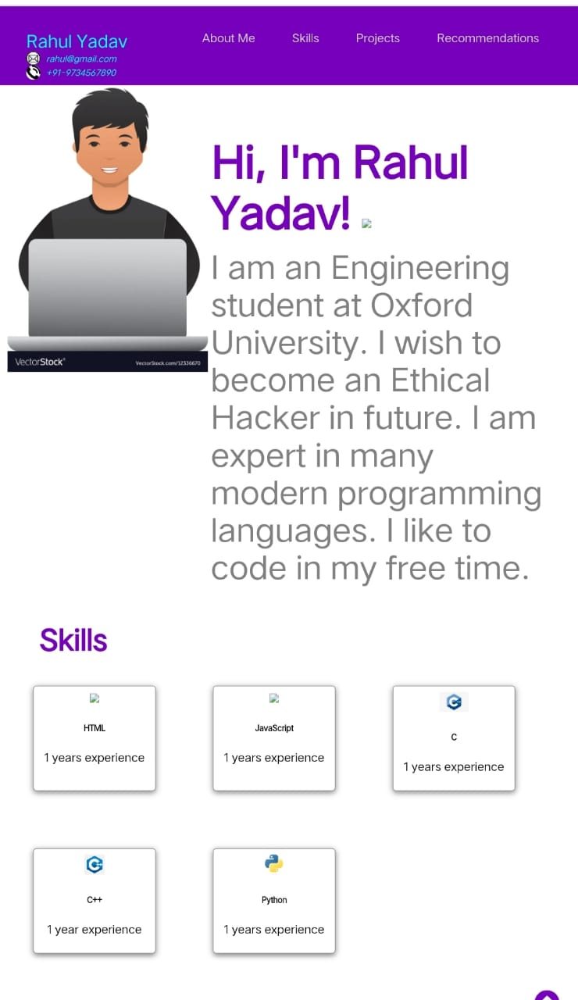
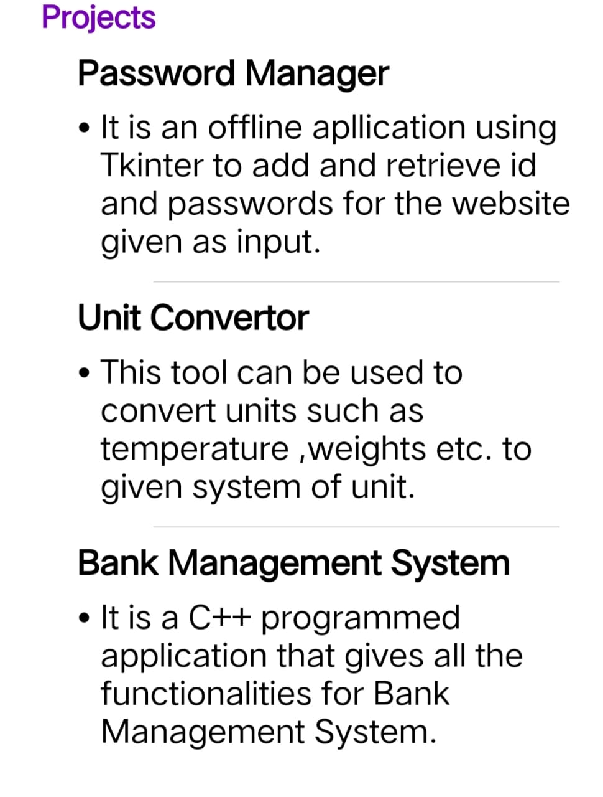
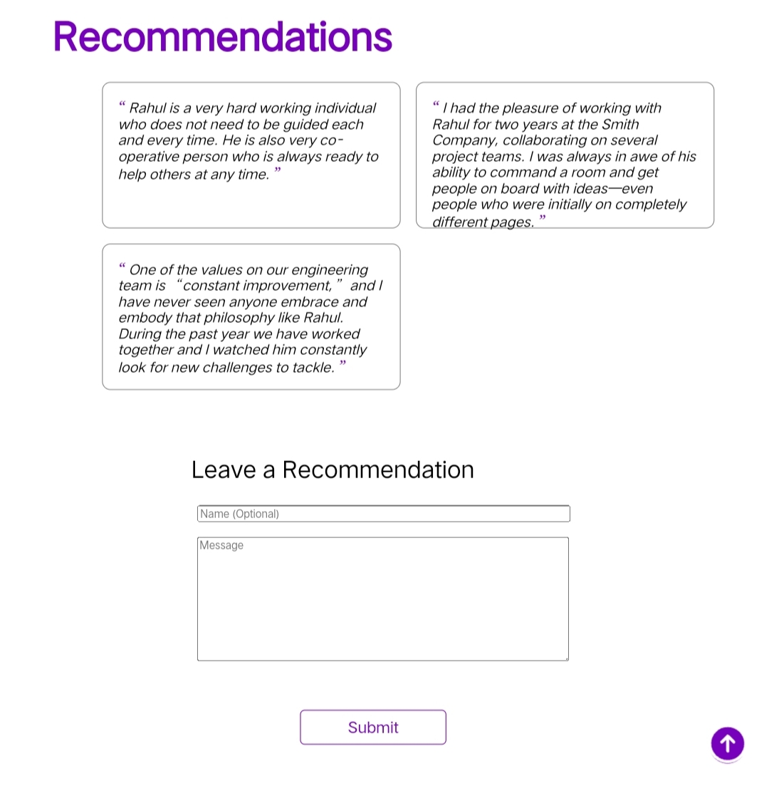

# FontEndProject-ProfessionalCV 👨‍💼

## Introduction

This is Rahul Yadav's personal portfolio website, showcasing his profile, skills, projects, recommendations, and a recommendation form.

## Snapshot
- 
- 
- 

## Demo

 - Try this [FontEndProject-ProfessionalCV ](https://rahulyadav147.github.io/FontEndProject-ProfessionalCV/)

## Sections

- Navigation Bar: Provides links to different sections, including contact info.
- About Me: Brief introduction, education, and interests.
- Skills: Displays skills with icons and descriptions.
- Projects: Showcases project cards with titles and descriptions.
- Recommendations: Features recommendations from colleagues.
- Recommendation Form: Allows visitors to leave their recommendations.
- Scroll to Top Button: A floating button for easy navigation.

  
## Connect 

## 
### Leave a 🌟 if it was Helpful!!
### Thanks!
